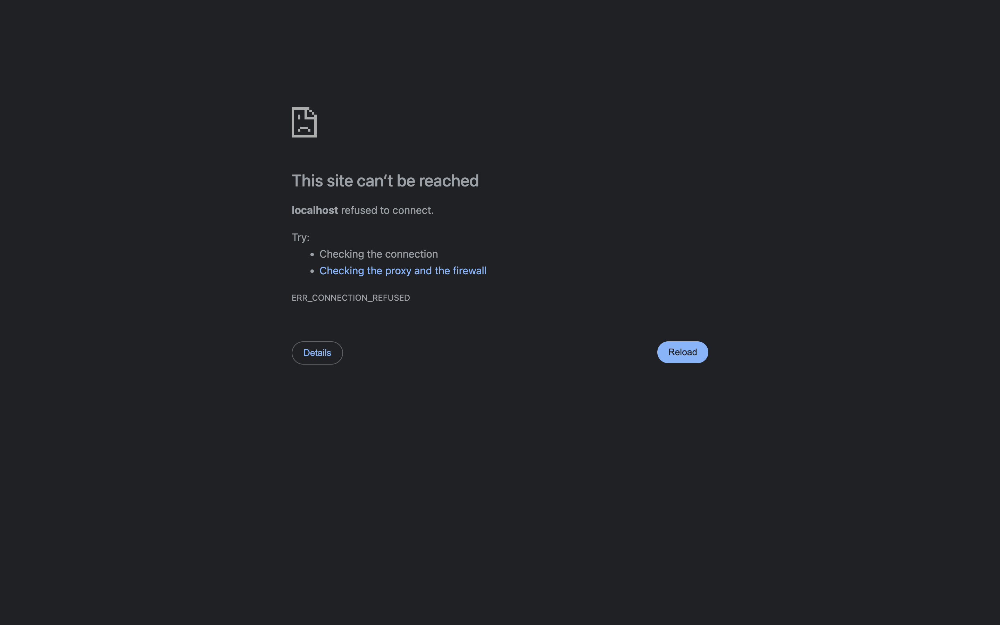

<table border="0" cellspacing="0" cellpadding="0">
<tr>
<td width="220" valign="middle">
<picture>
<source media="(prefers-color-scheme: dark)" srcset="docs/assets/logo-dark.png">

</picture>
</td>
<td valign="middle"><h1>C&nbsp;U&nbsp;S&nbsp;T&nbsp;O&nbsp;M&nbsp;I&nbsp;Z&nbsp;E &nbsp; A&nbsp;U&nbsp;T&nbsp;O&nbsp;S</h1></td>
</tr>
</table>

A Next.js B2C utility that allows users to upload a picture of their car and customize it using AI-powered image editing via Google's Gemini API (Gemini 2.5 Flash Image, also known as "nano banana").

## Features

- 📸 Upload car images
- 🎨 Accordion-based customization interface for:
  - Wheels (Sport, Classic, Chrome, Black, Alloy, Carbon Fiber)
  - Paint Colors (Racing Red, Electric Blue, Matte Black, etc.)
  - Accessories (Spoiler, Roof Rack, Tinted Windows, etc.)
- ⚡ Real-time AI-powered customization using Google Gemini API
- 💾 Download customized vehicle images

## Getting Started

### Prerequisites

- Node.js 18+ 
- npm or yarn
- Google Gemini API key ([Get one here](https://aistudio.google.com/apikey))

### Installation

1. Clone the repository:
```bash
git clone <your-repo-url>
cd customize-autos
```

2. Install dependencies:
```bash
npm install
```

3. Set up environment variables:
Create a `.env.local` file in the root directory

4. Add your Gemini API key to `.env.local`:
```
GEMINI_API_KEY=your_api_key_here
```

5. Run the development server:
```bash
npm run dev
```

6. Open [http://localhost:3000](http://localhost:3000) in your browser.

## Usage

1. **Upload**: Click to upload a picture of your car
2. **Customize**: Use the accordion interface to select wheels, paint colors, and accessories
3. **Process**: Click "Customize Vehicle" to submit your selections
4. **View**: Wait for the AI to process your customization (loading indicator will show)
5. **Download**: View and download your customized vehicle image

## Project Structure

```
customize-autos/
├── app/
│   ├── api/
│   │   └── customize/
│   │       └── route.ts          # Nano Banana API integration
│   ├── components/
│   │   ├── ImageUpload.tsx       # File upload component
│   │   ├── CustomizationAccordion.tsx  # Accordion UI for options
│   │   └── LoadingIndicator.tsx  # Loading state component
│   ├── page.tsx                  # Main application page
│   ├── layout.tsx
│   └── globals.css
├── public/
└── package.json
```

## API Integration

The app integrates with Google's Gemini API (specifically the `gemini-2.5-flash-image` model) for AI-powered image editing. The API route (`/api/customize`) handles:
- Image upload and processing
- Prompt generation based on user selections
- Communication with Google Gemini API
- Returning customized images

The integration uses the official `@google/generative-ai` SDK. For more information, see the [Gemini API Documentation](https://ai.google.dev/gemini-api/docs).

## Technologies

- **Next.js 16** - React framework with App Router
- **TypeScript** - Type safety
- **Tailwind CSS** - Styling
- **Google Gemini API** - AI image editing (Gemini 2.5 Flash Image model)

## License

MIT

## Screenshot


